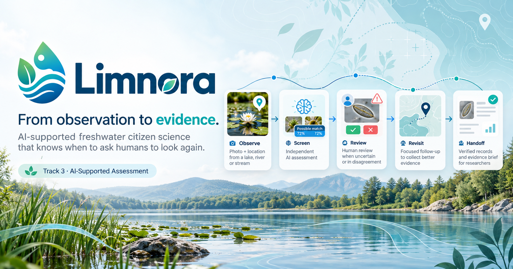
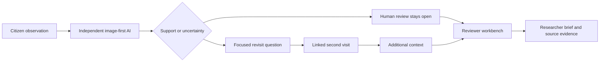
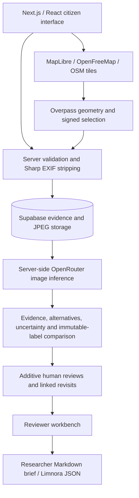

# Limnora

<p align="center">
  
</p>

**From observation to evidence.**

Limnora turns uncertain freshwater citizen observations into traceable, human-reviewed evidence and targeted revisit questions.

**Primary Track 3 · Responsible AI · Human-in-the-loop · One Health**

Built for the [OneAquaHealth IEEE Global Hackathon 2026](https://oneaquahealth-ieee-hackathon.devpost.com/). Supporting Tracks 1 (Citizen Science UX) and 2 (Data-to-Insight).

[Public source repository](https://github.com/SumitRaikwar18/Limnora) · [Judge guide](docs/JUDGE-GUIDE.md) · [Submission description](docs/submission/DEVPOST.md) · [Demo script](docs/submission/DEMO-SCRIPT.md)

Live demo: pending owner deployment and verification. Demo video: pending recording and public upload. These are explicit missing assets; no live URL has been supplied.

Social previews use the same `public/Limnora.png` banner. Set `NEXT_PUBLIC_SITE_URL` to the verified public HTTPS origin **before building** to enable correct canonical links, Open Graph/Twitter image URLs, sitemap and indexing. Unconfigured/local/preview builds remain noindex; `VERCEL_ENV=preview` overrides indexing. Metadata and structured descriptions aid discovery, but do not guarantee search rankings or AI citations. GitHub repository social preview is a separate repository setting and must use this banner there too.

## The problem

Citizen photographs help communities document ponds, lakes and streams, but a quick label can misinterpret floating plants, surface films or ordinary vegetation. A single image cannot establish ecosystem health. Limnora keeps the original observation, independent image interpretation and human review together, so uncertainty becomes a specific request for better evidence.

## Evidence Assurance Loop

**AI disagreement is the next data-collection question.**



The signature comparison shows the observer label beside the AI interpretation, visible evidence, alternatives and qualitative uncertainty. AI receives the photograph without the observer category or descriptive guess. The original label remains unchanged. A disputed record keeps its evidence state even when it is a linked revisit.

## 60-second judge walkthrough

1. Select mapped inland water, or explicitly declare an unmapped freshwater body.
2. Add a permissioned original photo, actual visit time and field notes. Unknown is a valid answer.
3. Run independent AI screening and inspect the observer-versus-AI comparison.
4. Add a reasoned human review. Suggestions remain traceable.
5. Plan a focused revisit. If a genuine second visit exists, compare newly added context and observer-reported differences.
6. Open **Review** to inspect priorities, source evidence, next questions and linked visits.
7. Download a researcher brief or Limnora JSON.

“See the evidence loop” opens only the configured showcase observation. Without a configured record, it guides the user to submit genuine evidence. Set `NEXT_PUBLIC_SHOWCASE_OBSERVATION_ID` only after obtaining permission for that record.

## Real field case

**Pending permissioned original photographs. Revisit pending.**

No real field case or completed environmental improvement is asserted. Supply a water-body identity/location, actual observation time, original photograph, permission to publish/process it, observer interpretation and field notes. A second visit needs a genuinely later time and a new photo; it must not be fabricated.

The [field-case requirements](evaluation/FIELD-CASE.md) describe exact inputs. A changed observation does not establish ecological improvement or deterioration.

## Evaluation

**Evaluation pending permissioned original field photographs.**

The [evaluation harness](evaluation/README.md) reads saved results by observation ID and reports sample size, completed screenings, failures, relevance, coarse-category agreement, uncertainty, disagreements, model and prompt version. [Results status](evaluation/RESULTS.md) contains no invented metrics.

Small convenience samples do not establish deployment accuracy. Team labels are not expert ecological ground truth unless an expert actually supplied them. Integration smoke tests verify the software workflow and do not measure ecological accuracy.

## Reviewer → researcher handoff

The dedicated **Review** view gives each loaded record a transparent priority: field review suggested, interpretation review, more evidence needed or review open. Priorities derive from reported concerns and missing/conflicting evidence; they are not danger rankings.

Each card provides a review reason, source photograph, original category, independent interpretation, separate evidence/visit badges, next field question and linked-revisit count. Downloadable researcher briefs preserve these sources and limitations for a freshwater researcher or local environmental officer to review.

## One Health relevance

- **Environment:** document visible vegetation, litter, water appearance and water extent.
- **Animals and ecosystems:** retain aquatic-life and habitat context for qualified review.
- **Communities:** make observations understandable and support stewardship and evidence handoff.

Category guidance links to claim-specific EPA, USGS, environmental-agency and National Weather Service references. These provide general context, not local diagnoses, species confirmation or an official partnership.

## Architecture



Experimental FHIR export is secondary; [interoperability notes](docs/INTEROPERABILITY.md) document its prototype-only status. No profile validation or OneAquaHealth integration is claimed.

## Responsible AI and trust boundary

Limnora stores observer statements, image-supported interpretations, model/prompt provenance, map-source metadata and review/revisit relationships. Human reviews are additive; original labels remain immutable.

Reports are saved before screening. AI outages preserve saved reports and failed reassessments preserve a previous successful result. Unavailable screening is displayed with a recovery action.

Photographs do not establish pathogens, toxicity, potability, water safety, measured pollution, ecological improvement or authenticity. Browser corroboration does not establish unique people or physical presence. Mapping and observer freshwater declarations do not measure salinity.

## Technical highlights and scale

Next.js, React, TypeScript, Supabase, OpenRouter and Sharp power the evidence workflow. Photos are decoded, bounded, resized and re-encoded without EXIF. Keys stay server-side; public responses remove owner/reviewer/photo hashes and provider attempt diagnostics.

Observation reads are bounded to at most 200 rows per request, ordered by observation date and ID, with offset pagination and optional observation-ID, water-body, category, date and map-bounds filters. The UI loads 100 at a time and deduplicates appended pages; opening a record fetches its water-body context. Counts describe loaded records, not a complete environmental survey. Offset pages can shift when concurrent observations arrive; refresh restarts pagination.

Shared rate limits, background AI jobs, organization accounts and staffed moderation remain future production work. Current rate limits and AI locks are process-local. Content removal is performed by the maintainer through Supabase using exact report/storage IDs.

## Testing

```sh
npm ci
npm run test
npm run typecheck
npm run build
node scripts/freshwater-checks.mjs
node --env-file=.env.local scripts/evidence-smoke.mjs
```

The configured integration smoke uses explicitly labeled temporary synthetic fixtures, tests persistence, EXIF removal, duplicate rejection, immutable labels, additive reviews, actual inference and linked visits, then removes only its own records/photos. It consumes provider quota and requires an existing public fixture. It is not a permissioned field evaluation.

## Setup

### Vercel environment and analytics

Use the Next.js preset, `npm ci` for installation and `npm run build` for the build. Configure these in Project Settings → Environment Variables:

| Variable | Value / purpose |
| --- | --- |
| `NEXT_PUBLIC_SUPABASE_URL` | Your Supabase project HTTPS URL |
| `SUPABASE_SECRET_KEY` | Supabase server secret/service-role key; never prefix with `NEXT_PUBLIC_` |
| `OPENROUTER_API_KEY` | Server-only OpenRouter key |
| `OPENROUTER_MODEL` | Your tested image-capable model ID; current example is `qwen/qwen3.8-27b:free` and provider quotas still apply |
| `NEXT_PUBLIC_SITE_URL` | Verified production HTTPS origin, without a path; required for correct social/canonical URLs and indexing |
| `NEXT_PUBLIC_SHOWCASE_OBSERVATION_ID` | Optional permissioned original showcase report ID |
| `NEXT_PUBLIC_OSM_TILE_URL` | Optional tile override; leave unset for the default map |

The legacy `NEXT_PUBLIC_SUPABASE_ANON_KEY` example is not read by current code and is not required. Vercel supplies `NODE_ENV` and `VERCEL_ENV`; do not manually override them. Keep real database/AI credentials scoped to Production; use separate test resources for Preview if preview writes are wanted. Redeploy after environment changes, especially public variables baked into the build. Apply the documented Supabase schema/storage/hardening migrations before testing the hosted flow.

Enable **Web Analytics** in the Vercel project dashboard, then deploy. No analytics API key is required. The existing analytics SDK is wrapped in a small client component and enabled only for Vercel Production deployments. It counts allowlisted public page views with query strings/fragments removed; custom events and report/API paths are dropped. It does not send photos, observation text, GPS fields or review content as custom analytics. Browser/provider network metadata still exists; this is not an anonymity guarantee. Dashboard event collection must be verified after deployment.

Use Node.js 22 or newer and npm with the committed `package-lock.json`.

The repository intentionally uses **npm only**. `vercel.json` pins installation to `npm ci` and the build to `npm run build`. Do not add a second package-manager lockfile: a stale pnpm lock can make deployment choose a dependency tree that differs from the tested npm tree. If a Vercel dashboard override still specifies pnpm, clear it or set the install command to `npm ci`.

1. Run `npm ci`.
2. Create a Supabase project and apply `supabase/schema.sql`, `supabase/server-access-hardening.sql`, then `supabase/freshwater-readiness.sql`.
3. Copy `.env.example` to `.env.local`. Set the Supabase URL, server-only `SUPABASE_SECRET_KEY`, `OPENROUTER_API_KEY` and vision-capable `OPENROUTER_MODEL`.
4. Run `npm run dev` and open `http://localhost:3000`.

Production: `npm run build`, then `npm run start`. Configure server environment values in the host; never upload or commit `.env.local`. `/api/health` checks configuration shape only, not live database/provider connectivity. Free provider availability varies; an explicitly configured paid model may consume credits.

GPS is optional; manual reporting remains available. Browser location requires HTTPS or localhost. OSM coverage may miss small ponds; observer-declared provenance stays visible.

## Submission and limitations

The required 3–5 minute video remains pending. Owner eligibility, registration, project dates and final Devpost submission require verification. The official event website prevails over repository guidance.

Permissioned field evaluation, a genuine revisit and hosted verification remain pending. Local browser checks covered Explore, Review and the evidence dialog, plus responsive layout bounds; these are not a complete cross-browser/device or failure-path audit. See the judge guide for verification scope. No IEEE endorsement, guaranteed win or worldwide-novelty claim is made.

## License and attribution

Original code: [MIT License](LICENSE), copyright Sumit Raikwar. Map data, dependencies and submitted photographs retain their own rights; see [third-party notices](THIRD-PARTY-NOTICES.md). The code license does not license user photographs or hackathon branding.

**Limnora turns disagreement into better data.**
