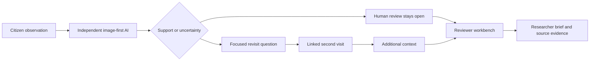
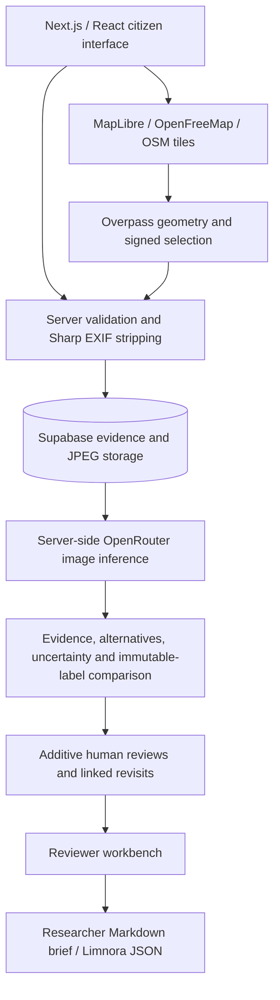

# Limnora

<p align="center">
  
</p>

**From observation to evidence.**

Limnora turns uncertain freshwater citizen observations into traceable, human-reviewed evidence and targeted revisit questions.

**Primary Track 3 · Responsible AI · Human-in-the-loop · One Health**

Built for the [OneAquaHealth IEEE Global Hackathon 2026](https://oneaquahealth-ieee-hackathon.devpost.com/). Supporting Tracks 1 (Citizen Science UX) and 2 (Data-to-Insight).

[Public source repository](https://github.com/SumitRaikwar18/Limnora) · [Judge guide](docs/JUDGE-GUIDE.md) · [Submission description](docs/submission/DEVPOST.md) · [Demo script](docs/submission/DEMO-SCRIPT.md) · [Deployment guide](docs/DEPLOYMENT.md)

---

## Quick Links

- 🌐 **Live Demo**: [https://limnora.vercel.app](https://limnora.vercel.app)
- 🎬 **Demo Video**: [Watch on YouTube (https://youtu.be/8IYc2NB8z7c)](https://youtu.be/8IYc2NB8z7c)
- 📋 **Judge Guide**: [`docs/JUDGE-GUIDE.md`](docs/JUDGE-GUIDE.md)
- 🚀 **Deployment & Setup**: [`docs/DEPLOYMENT.md`](docs/DEPLOYMENT.md)

---

## The Problem

Citizen photographs help communities document ponds, lakes and streams, but a quick label can misinterpret floating plants, surface films or ordinary vegetation. A single image cannot establish ecosystem health. Limnora keeps the original observation, independent image interpretation and human review together, so uncertainty becomes a specific request for better evidence.

---

## Evidence Assurance Loop

**AI disagreement is the next data-collection question.**



The signature comparison shows the observer label beside the AI interpretation, visible evidence, alternatives and qualitative uncertainty. AI receives the photograph without the observer category or descriptive guess. The original label remains unchanged. A disputed record keeps its evidence state even when it is a linked revisit.

---

## 60-Second Judge Walkthrough

1. **Map & Select**: Select mapped inland water, or explicitly declare an unmapped freshwater body.
2. **Citizen Observation**: Add a permissioned original photo, actual visit time and field notes.
3. **Independent AI Screening**: AI receives only the image (blind to user label) and outputs interpretation, visible evidence, and uncertainty.
4. **Human Review**: Add a reasoned human review. Traceable, additive suggestions preserve original provenance.
5. **Targeted Revisit**: Plan a focused revisit. Compare newly added context and observer-reported differences.
6. **Reviewer Workbench**: Open **Review** to inspect priorities, source evidence, next questions and linked visits.
7. **Researcher Handoff**: Download a structured researcher brief or Limnora JSON evidence package.

---

## Real Field Case

**Pending permissioned original photographs. Revisit pending.**

No real field case or completed environmental improvement is asserted without verified field assets. The [field-case requirements](evaluation/FIELD-CASE.md) describe exact inputs. A changed observation does not establish ecological improvement or deterioration.

---

## Evaluation

**Evaluation pending permissioned original field photographs.**

The [evaluation harness](evaluation/README.md) reads saved results by observation ID and reports sample size, completed screenings, failures, relevance, coarse-category agreement, uncertainty, disagreements, model and prompt version. [Results status](evaluation/RESULTS.md) contains no invented metrics.

---

## Reviewer → Researcher Handoff

The dedicated **Review** view gives each loaded record a transparent priority: *field review suggested, interpretation review, more evidence needed or review open*. Priorities derive from reported concerns and missing/conflicting evidence; they are not danger rankings.

Each card provides:
- Review reason & priority badge
- Source photograph with EXIF stripped
- Original citizen category vs. independent AI interpretation
- Next field revisit question
- Linked revisit counter & history
- Exportable researcher Markdown brief & Limnora JSON

---

## One Health Relevance

- **Environment:** Document visible vegetation, litter, water appearance, and water extent.
- **Animals & Ecosystems:** Retain aquatic-life and habitat context for qualified review.
- **Communities:** Make observations understandable and support local freshwater stewardship.

Category guidance links directly to claim-specific EPA, USGS, environmental-agency and National Weather Service references.

---

## Architecture



Experimental FHIR export is secondary; [interoperability notes](docs/INTEROPERABILITY.md) document its prototype-only status.

---

## Responsible AI and Trust Boundary

- **Immutable labels**: Original user input is never overwritten by AI output.
- **Image-first blind screening**: AI receives the image without the user's category guess.
- **Graceful degradation**: Reports are saved before AI screening. AI outages preserve records, with retry actions.
- **Explicit limitations**: Single photographs do not establish pathogens, toxicity, potability, or chemical water safety.

---

## Technical Highlights and Scale

- **Stack**: Next.js 16 (App Router), React 19, TypeScript, Tailwind CSS, Supabase, OpenRouter, Sharp.
- **Image Safety**: Server-side metadata stripping and EXIF scrubbing via Sharp.
- **Bounded Queries**: Server queries are bounded to at most 200 rows per request with offset pagination and map-bounds filtering.
- **Scale Path**: Bounded server queries today; cursor pagination, background worker queues, and staffed moderation for production scale.

---

## Run Locally

```sh
# 1. Install dependencies (npm only)
npm ci

# 2. Configure environment
cp .env.example .env.local

# 3. Start local development server
npm run dev
```

See [**`docs/DEPLOYMENT.md`**](docs/DEPLOYMENT.md) for full instructions on Supabase migrations, Vercel deployment, environment variables, and production setup.

---

## Testing & Quality

```sh
npm test          # Run freshwater checks & schema validation
npm run typecheck # Run TypeScript strict check
npm run build     # Validate production Next.js build
```

---

## License and Attribution

Original code: [MIT License](LICENSE), copyright Sumit Raikwar. Map data, dependencies and submitted photographs retain their own rights; see [third-party notices](THIRD-PARTY-NOTICES.md).

**Limnora turns disagreement into better data.**
